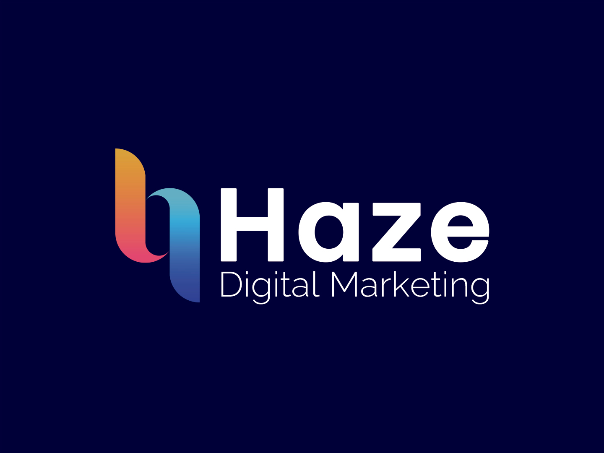

<h1 align="center">Renan Iomes</h1>

  <b>Desenvolvedor de software</b> · fundador da <a href="https://hazemkt.com">Haze</a>

  Mentalidade full-stack — construo produtos de ponta a ponta, onde <b>engenharia, estratégia e dados</b> se encontram.

  
  

---

### 👋 Sobre

Engenheiro de software com base full-stack e visão de dono de negócio. Construo produtos web e mobile com **React, TypeScript e .NET**, e toco a **[Haze](https://hazemkt.com)**, minha agência de marketing digital — o que significa que escrevo código entendendo funil, conversão e as métricas que dizem se o produto realmente funciona.

- 🏢 Desenvolvedor de software na **Stefanini / Topaz Evolution** — produtos fintech em times ágeis (React, TypeScript, Redux, REST APIs, .NET)
- 🔭 Fundador e head de operação da **[Haze](https://hazemkt.com)**, minha agência de marketing digital
- 🎓 Bacharel em Engenharia de Software — Católica de Santa Catarina (2022–2026)
- 🌱 Estudando francês nas horas vagas
- 📫 Contato: **renan@hazemkt.com**

---

### 🛠 Desenvolvimento

### 🗄 Dados & Infra

### 📊 Marketing & Dados

### 🎨 Design

---

### 🌐 Vamos conversar

  
  
  
  &nbsp;
  

